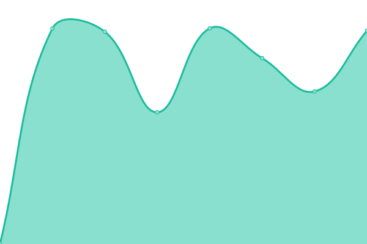

# [📈 实时状态](https://status.wjghj.cn): <!--live status--> **好耶，系统全功率运转中~**

This repository contains the open-source uptime monitor and status page for [万界规划局 Every Planing Bureau](https://www.wjghj.cn), powered by [Upptime](https://github.com/upptime/upptime).

With [Upptime](https://upptime.js.org), you can get your own unlimited and free uptime monitor and status page, powered entirely by a GitHub repository. We use [Issues](https://github.com/Wjghj-Project/status/issues) as incident reports, [Actions](https://github.com/Wjghj-Project/status/actions) as uptime monitors, and [Pages](https://status.wjghj.cn) for the status page.

## [📈 Live Status](https://demo.upptime.js.org): <!--live status--> **好耶，系统全功率运转中~**

<!--start: status pages-->
<!-- This summary is generated by Upptime (https://github.com/upptime/upptime) -->
<!-- Do not edit this manually, your changes will be overwritten -->
<!-- prettier-ignore -->
| URL | 状态 | 历史 | 响应时间 | 可用率 |
| --- | ------ | ------- | ------------- | ------ |
|  [小鱼君和他的朋友们 (Wjghj Wiki)](https://www.wjghj.cn) | 正常运行 | [wjghj-wiki.yml](https://github.com/Wjghj-Project/status/commits/HEAD/history/wjghj-wiki.yml) | 

 5793ms
     
 | 

<a href="https://status.wjghj.cn/history/wjghj-wiki">98.29%</a>
    

|  [小鱼君的博客 (Dragon Fish's Blog)](https://blog.wjghj.cn) | 正常运行 | [dragon-fish-s-blog.yml](https://github.com/Wjghj-Project/status/commits/HEAD/history/dragon-fish-s-blog.yml) | 

 264ms
     
 | 

<a href="https://status.wjghj.cn/history/dragon-fish-s-blog">100.00%</a>
    

|  [万界规划局共享资源库 (Wjghj Project Static Database)](https://common.wjghj.cn) | 正常运行 | [wjghj-project-static-database.yml](https://github.com/Wjghj-Project/status/commits/HEAD/history/wjghj-project-static-database.yml) | 

 3064ms
     
 | 

<a href="https://status.wjghj.cn/history/wjghj-project-static-database">98.99%</a>
    

|  [万界大百科 (Wjghj Notion)](https://www.notion.so/epbureau/9a6d9bd0704244a1818624f032d013f9) | 正常运行 | [wjghj-notion.yml](https://github.com/Wjghj-Project/status/commits/HEAD/history/wjghj-notion.yml) | 

 318ms
     
 | 

<a href="https://status.wjghj.cn/history/wjghj-notion">100.00%</a>
    

|  [Chatbot SILI](https://sili.wjghj.cn) | 正常运行 | [chatbot-sili.yml](https://github.com/Wjghj-Project/status/commits/HEAD/history/chatbot-sili.yml) | 

 2156ms
     
 | 

<a href="https://status.wjghj.cn/history/chatbot-sili">97.78%</a>
    

|  [游戏人生 Wiki 项目组 (NGNL Wiki Project Team)](https://ngnlwiki.cn) | 正常运行 | [wiki-ngnl-wiki-project-team.yml](https://github.com/Wjghj-Project/status/commits/HEAD/history/wiki-ngnl-wiki-project-team.yml) | 

 2382ms
     
 | 

<a href="https://status.wjghj.cn/history/wiki-ngnl-wiki-project-team">99.81%</a>
    

|  [万界规划局 wiki (EPBureau Fandom)](https://epbureau.fandom.com) | 正常运行 | [wiki-ep-bureau-fandom.yml](https://github.com/Wjghj-Project/status/commits/HEAD/history/wiki-ep-bureau-fandom.yml) | 

 371ms
     
 | 

<a href="https://status.wjghj.cn/history/wiki-ep-bureau-fandom">100.00%</a>
    

<!--end: status pages-->

[**Visit our status website →**](https://status.wjghj.cn)

## 📄 License

- Powered by: [Upptime](https://github.com/upptime/upptime)
- Code: [MIT](./LICENSE) © [万界规划局 Every Planing Bureau](https://www.wjghj.cn)
- Data in the `./history` directory: [Open Database License](https://opendatacommons.org/licenses/odbl/1-0/)
